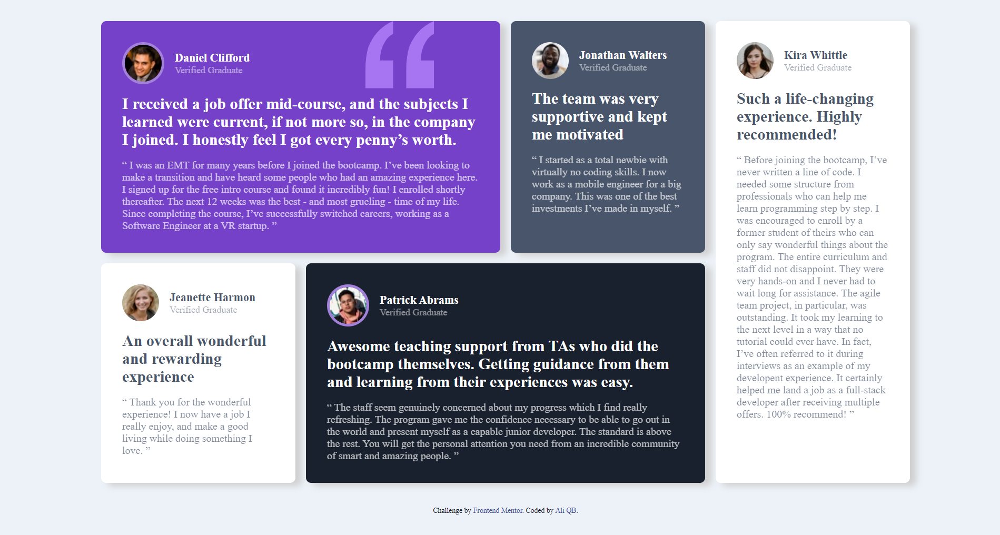

# Frontend Mentor - Testimonials grid section solution

This is a solution to the [Testimonials grid section challenge on Frontend Mentor](https://www.frontendmentor.io/challenges/testimonials-grid-section-Nnw6J7Un7). Frontend Mentor challenges help you improve your coding skills by building realistic projects. 

## Table of contents

- [Overview](#overview)
  - [Screenshot](#screenshot)
  - [Links](#links)
- [My process](#my-process)
  - [Built with](#built-with)
  - [What I learned](#what-i-learned)

**Note: Delete this note and update the table of contents based on what sections you keep.**

## Overview
simple layout for testimonials.

### Screenshot

### Links

- Solution URL: [solution](https://https://www.frontendmentor.io/solutions/responsive-testimonialsgridsection-with-gird-and-flexbox-PKhM-YL69)
- Live Site URL: [live in vercel](https://testimonials-grid-section-main-frontend-mentor-six.vercel.app/)

### Built with

- Semantic HTML5 markup
- CSS custom properties
- Flexbox
- CSS Grid

